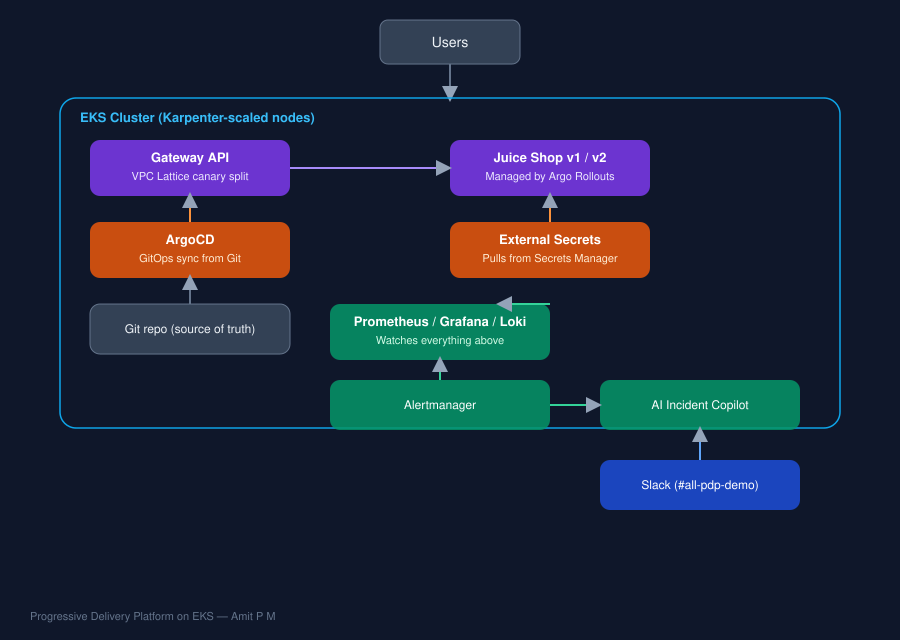

# Progressive Delivery Platform on EKS

A production-pattern Kubernetes platform built to demonstrate real-world DevOps practice: autoscaling, progressive delivery, GitOps, observability, and an AI-driven incident response loop — all running on live AWS infrastructure.



## Why this project

Most portfolio projects stop at "I deployed an app to Kubernetes." This one goes further: it's a self-healing delivery pipeline where a bad deploy is automatically detected and rolled back before it reaches real users — with zero manual intervention — and an AI copilot explains *why* it happened in plain English, in Slack, within seconds.

The target application is [OWASP Juice Shop](https://owasp-juice.shop/), a widely used security-training web app — a deliberate nod to building the kind of resilient, observable infrastructure that security-focused platforms (like CloudSEK's own products) need to run on.

## What this demonstrates

| Capability | How it's implemented |
|---|---|
| Infrastructure as Code | Terraform-provisioned VPC, EKS cluster, and Karpenter IAM/SQS plumbing |
| Kubernetes autoscaling | Karpenter, scoped to free-tier instance families, provisioning real nodes on demand in ~10s |
| Modern traffic routing | Kubernetes Gateway API backed by AWS VPC Lattice, with native weighted canary traffic splitting |
| GitOps | ArgoCD auto-syncing the cluster to this repo — a `git push` is the deployment mechanism, not `kubectl apply` |
| Progressive delivery | Argo Rollouts driving automated, metrics-gated canary releases (10% → analysis → 50% → 100%) |
| Automated rollback | A Prometheus-backed `AnalysisTemplate` checks real request-rate metrics from an nginx sidecar during every canary step; a broken deploy is automatically halted and traffic is never shifted to it |
| Secrets management | External Secrets Operator syncing from AWS Secrets Manager — no secrets ever committed to Git or hardcoded in manifests |
| Observability | Prometheus, Grafana, and Loki (the LGTM-style stack) with Alertmanager routing real alerts to Slack |
| AI-driven operations | A Claude-powered incident copilot that reads live Prometheus and Loki context when an alert fires and posts a plain-English root-cause summary to Slack |

## Repository structure

```
.
├── terraform/                          # VPC, EKS, Karpenter IAM (Story 1-3)
├── manifests/                          # Everything ArgoCD watches and syncs
│   ├── juice-shop-v1.yaml              # Stable Service
│   ├── juice-shop-v2.yaml              # Canary Service
│   ├── gateway.yaml / gatewayclass.yaml/ httproute-canary.yaml
│   ├── rollout.yaml                    # Argo Rollouts canary strategy
│   ├── analysistemplate.yaml           # Prometheus-backed rollback gate
│   ├── secretstore.yaml / externalsecret.yaml
│   ├── servicemonitor.yaml
│   ├── ai-copilot.yaml                 # AI Incident Copilot Deployment/Service
│   ├── ai-copilot-externalsecret.yaml
│   └── alertmanager-with-copilot-values.yaml
├── ai-copilot/                         # AI Incident Copilot source
│   ├── app.py
│   ├── requirements.txt
│   └── Dockerfile
└── docs/
    └── architecture.svg
```

## How it works, end to end

1. A change is pushed to this repo (e.g. a new app version in `rollout.yaml`).
2. **ArgoCD** detects the change and syncs it to the cluster automatically.
3. **Argo Rollouts** starts a canary release: 10% of traffic is shifted to the new version via the **Gateway API / VPC Lattice** route.
4. An **AnalysisTemplate** queries **Prometheus** every 20 seconds during the canary phase, checking real request-rate metrics from an nginx sidecar.
5. If the canary is healthy, traffic progressively increases to 50% then 100%. If it's broken (crash-looping, bad image, zero traffic), Rollouts **automatically aborts** — the broken version never receives meaningful traffic, and stable traffic is unaffected throughout.
6. **Prometheus, Grafana, and Loki** continuously watch cluster and application health.
7. If something breaks, **Alertmanager** fires and calls the **AI Incident Copilot**, which pulls the relevant Prometheus and Loki context, asks Claude to summarize the likely root cause, and posts it to Slack — before a human even opens a dashboard.

## Setup (high level)

Full step-by-step build notes live in the commit history of this repo — it was built and debugged story by story, live, with real infrastructure. At a high level:

```bash
# 1. Provision infra
cd terraform && terraform init && terraform apply

# 2. Point kubectl at the new cluster
aws eks update-kubeconfig --name pdp-eks-cluster --region us-east-1

# 3. Install Karpenter, Gateway API controller, ArgoCD, Argo Rollouts,
#    External Secrets, and the kube-prometheus-stack (see commit history
#    for exact Helm commands and values used for each)

# 4. Point ArgoCD at this repo's manifests/ directory — from here on,
#    every change is deployed via `git push`, not manual kubectl commands

# 5. Build and push the AI Copilot image, create its AWS Secrets Manager
#    entries (ANTHROPIC_API_KEY, Slack webhook), and apply
#    manifests/ai-copilot.yaml + ai-copilot-externalsecret.yaml
```


## Tech stack

AWS (EKS, VPC, IAM, Secrets Manager, VPC Lattice) · Terraform · Kubernetes · Karpenter · Gateway API · ArgoCD · Argo Rollouts · External Secrets Operator · Prometheus · Grafana · Loki · Alertmanager · Claude API · Python (Flask) · Docker

## Author

**Amit P M** — DevOps/Cloud Engineer
[LinkedIn](#) · [GitHub](https://github.com/amit-cloudops-ai)
